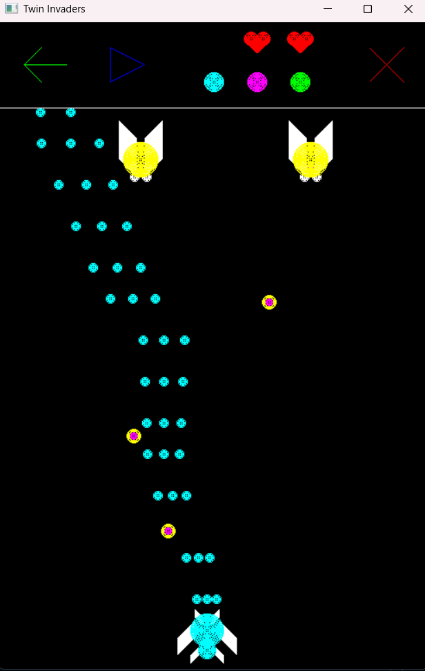

# Twin Invaders

A classic space shooter game implemented in Python using OpenGL. Defend Earth from alien invaders by controlling a spacecraft and shooting down enemies while avoiding their attacks.

<div align="center">
  
</div>

<div align="center">
  <h3><a href="https://surli.cc/euliul">🎮 Live Demo</a></h3>
  <p>
    <strong>Developers:</strong> 
    <a href="https://github.com/Lawrence-Amlan-Gomes">Lawrence Amlan Gomes</a> | 
    <a href="https://github.com/noobcoder-hasan">Hasan Sarwar Zami</a> | 
    A K M Nihalul Kabir
  </p>
</div>

## Table of Contents

- [Overview](#overview)
- [Features](#features)
- [Requirements](#requirements)
- [Installation](#installation)
- [How to Play](#how-to-play)
- [Game Controls](#game-controls)
- [Game Mechanics](#game-mechanics)
- [Technical Implementation](#technical-implementation)
- [Project Structure](#project-structure)
- [Contributing](#contributing)
- [License](#license)

## Overview

Twin Invaders is a 2D space shooter game developed as part of the CSE423 Computer Graphics Lab course. The game features classic arcade-style gameplay where players control a spacecraft to eliminate alien invaders while managing limited lives and achieving high scores.

## Features

- **Classic Arcade Gameplay**: Navigate and shoot in a retro-style space shooter environment
- **Dynamic Enemy**: Aliens move horizontally and fire projectiles at the player
- **Progressive Difficulty**: Multiple bullet patterns and increasing challenge levels
- **Life System**: Three lives with visual heart indicators
- **Score Tracking**: Real-time score display based on alien eliminations
- **Game State Management**: Play, pause, restart, and exit functionality
- **Smooth Graphics**: OpenGL-rendered graphics with fluid animations
- **Responsive Controls**: Keyboard and mouse input support

## Requirements

- Python 3.7 or higher
- OpenGL support
- Windows/Linux/macOS compatible

### Required Python Packages

- PyOpenGL
- PyOpenGL_accelerate

## Installation

1. **Clone the repository**:
   ```bash
   git clone https://github.com/nihal-kabir/CSE423-Computer-Graphics-Lab.git
   cd CSE423-Computer-Graphics-Lab
   ```

2. **Create a virtual environment** (recommended):
   ```bash
   python -m venv venv
   source venv/bin/activate  # On Windows: venv\Scripts\activate
   ```

3. **Install required packages**:
   ```bash
   pip install PyOpenGL PyOpenGL_accelerate
   ```

4. **Run the game**:
   ```bash
   python 423_project.py
   ```

## How to Play

The objective is to eliminate all alien invaders while avoiding their projectiles. You control a spacecraft at the bottom of the screen and must survive waves of alien attacks.

### Game Controls

| Control | Action |
|---------|--------|
| Left Arrow | Move spacecraft left |
| Right Arrow | Move spacecraft right |
| Spacebar | Fire bullets |
| P Key | Pause/Resume game |
| Mouse Click | Interact with UI elements |

### Game Mechanics

- **Lives**: Start with 3 lives (displayed as hearts)
- **Scoring**: Gain points by destroying alien invaders
- **Weapons**: Multiple bullet patterns unlock as you progress
- **Enemy Behavior**: Aliens move horizontally and shoot downward
- **Collision Detection**: Bullets and spacecraft interact with enemies and obstacles

## Technical Implementation

### Graphics Engine
- **OpenGL**: Hardware-accelerated 2D graphics rendering
- **GLUT**: Window management and input handling
- **Custom Rendering**: Hand-coded geometric shapes and animations

### Key Components

- **Renderer**: OpenGL-based drawing functions for all game objects
- **Physics Engine**: Collision detection and movement calculations
- **Game State Manager**: Handles play/pause/restart/exit states
- **Input Handler**: Keyboard and mouse event processing
- **Animation System**: Smooth object movement and visual effects

### Code Architecture

- **Modular Design**: Separate functions for different game components
- **Global State Management**: Efficient variable handling for game state
- **Event-Driven Programming**: Responsive input and animation loops
- **Real-time Rendering**: Continuous screen updates for smooth gameplay

## Project Structure

```
Twin Invaders/
│
├── 423_project.py          # Main game file
├── README.md               # Project documentation
└── requirements.txt        # Python dependencies (if created)
```

### Key Functions

- `show_screen()`: Main rendering loop
- `animate()`: Game logic and object updates
- `keyboardListener()`: Keyboard input handling
- `mouseListener()`: Mouse input processing
- `specialKeyListener1()`: Special key combinations
- Rendering functions for game objects (shooter, bullets, aliens, UI)

## Game Features Detail

### Visual Elements
- Spacecraft with customizable colors
- Animated bullet projectiles
- Moving alien enemies with directional AI
- UI elements (hearts, score, control buttons)
- Background and border graphics

### Audio-Visual Feedback
- Real-time score updates
- Visual life indicators
- Game state notifications
- Smooth animations and transitions

## Development Notes

This project demonstrates fundamental computer graphics concepts including:
- 2D coordinate systems and transformations
- Real-time rendering and animation
- Event-driven programming
- Collision detection algorithms
- Game state management
- OpenGL programming in Python

## Contributing

Contributions are welcome! Please feel free to submit pull requests or open issues for:
- Bug fixes
- Feature enhancements
- Code optimizations
- Documentation improvements

## License

This project is developed for educational purposes as part of the CSE423 Computer Graphics Lab course. Feel free to use and modify for learning purposes.

---

**Course**: CSE423 - Computer Graphics Lab  
**Institution**: BRAC University  
**Developer**: Lawrence Amlan Gomes, A K M Nihalul Kabir, Hasan Sarwar Zami  
**Academic Year**: 2024
