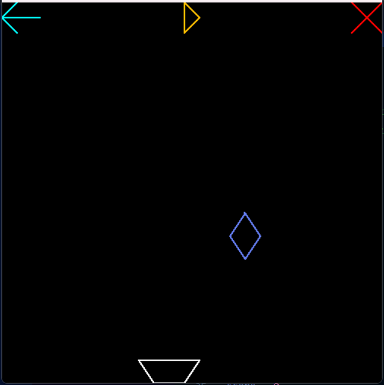

# Diamond Frenzy

[](https://www.python.org/downloads/)
[](https://pyopengl.sourceforge.net/)
[](#license)

A sophisticated 2D arcade-style game built using OpenGL and Python, featuring physics-based gameplay where players catch falling diamonds to achieve high scores.

<div align="center">
  
</div>

<div align="center">
  <h3><a href="https://youtube.com/shorts/SaO00gi65Bs?feature=share">🎮 YouTube Demo</a></h3>
</div>

## Table of Contents

- [Overview](#overview)
- [Features](#features)
- [Technical Implementation](#technical-implementation)
- [Installation](#installation)
- [Usage](#usage)
- [Game Controls](#game-controls)
- [Gameplay](#gameplay)
- [Code Architecture](#code-architecture)
- [Performance Specifications](#performance-specifications)
- [Development](#development)
- [System Requirements](#system-requirements)
- [Contributing](#contributing)
- [Author](#author)
- [License](#license)

## Overview

Diamond Frenzy is an interactive graphics game developed as part of CSE423 Computer Graphics Lab coursework. The game demonstrates advanced computer graphics concepts through real-time rendering, custom line drawing algorithms, and physics-based animations. Players control a dynamic catcher to collect colorful diamonds while experiencing progressively challenging gameplay mechanics.

## Features

### Core Gameplay
- **Real-time Diamond Catching**: Fluid gameplay with responsive controls
- **Progressive Difficulty**: Dynamic speed scaling based on player performance
- **Advanced Scoring System**: Point-based progression with visual feedback
- **Game State Management**: Comprehensive play, pause, restart, and exit functionality

### Graphics & Rendering
- **Custom Bresenham's Algorithm**: Hand-implemented line drawing with zone conversion
- **OpenGL Integration**: Hardware-accelerated 2D graphics rendering
- **Dynamic Color Generation**: Procedural diamond coloration system
- **Smooth Animations**: Double-buffered rendering for fluid visual experience

### Interactive Elements
- **Multi-input Support**: Keyboard and mouse interaction systems
- **Collision Detection**: Precise boundary and object collision algorithms
- **Real-time Physics**: Gravity-based diamond movement simulation

## Technical Implementation

### Graphics Engine
- **Bresenham's Line Algorithm**: Custom implementation with 8-zone coordinate conversion
- **Primitive Rendering**: OpenGL point and line primitives for geometric construction
- **Coordinate System**: Orthographic projection with normalized device coordinates
- **Buffer Management**: Double buffering for tear-free animation rendering

### Mathematical Foundations
- **Zone-based Line Drawing**: Converts all line segments to Zone 0 for optimal processing
- **Collision Mathematics**: AABB (Axis-Aligned Bounding Box) collision detection
- **Physics Simulation**: Euler integration for diamond movement dynamics
- **Coordinate Transformations**: Screen-space to world-space coordinate mapping

### Game Architecture
- **Event-driven Programming**: Asynchronous input handling and state management
- **Real-time Rendering Loop**: Continuous display updates at optimal frame rates
- **Modular Design**: Separated concerns for rendering, physics, and game logic
- **Memory Management**: Efficient resource allocation and cleanup

### Dependencies
```python
PyOpenGL==3.1.7           # OpenGL bindings for Python
PyOpenGL_accelerate==3.1.7 # Performance optimization extensions
random                     # Built-in random number generation
```

## Installation

### Prerequisites
- **Python**: Version 3.7 or higher
- **pip**: Python package installer
- **OpenGL**: Compatible graphics drivers

### Quick Start

1. **Clone the Repository**
   ```bash
   git clone https://github.com/nihal-kabir/CSE423-Computer-Graphics-Lab.git
   cd "CSE423-Computer-Graphics-Lab/Solo Project 2"
   ```

2. **Set Up Virtual Environment** (Recommended)
   ```bash
   # Create virtual environment
   python -m venv diamond_frenzy_env
   
   # Activate environment
   # Windows:
   diamond_frenzy_env\Scripts\activate
   # macOS/Linux:
   source diamond_frenzy_env/bin/activate
   ```

3. **Install Dependencies**
   ```bash
   pip install -r requirements.txt
   ```
   
   Or install manually:
   ```bash
   pip install PyOpenGL PyOpenGL_accelerate
   ```

4. **Verify Installation**
   ```bash
   python -c "import OpenGL.GL; print('OpenGL successfully imported')"
   ```

## Usage

### Running the Game
```bash
python "solo 2.py"
```

### Alternative Execution Methods
```bash
# Direct execution
python3 "solo 2.py"

# With virtual environment
diamond_frenzy_env/Scripts/python "solo 2.py"  # Windows
diamond_frenzy_env/bin/python "solo 2.py"     # macOS/Linux
```

## Game Controls

### Keyboard Input
| Key | Action | Description |
|-----|--------|-------------|
| `←` Left Arrow | Move Left | Moves catcher leftward within boundary constraints |
| `→` Right Arrow | Move Right | Moves catcher rightward within boundary constraints |

### Mouse Input
| Region | Action | Visual Indicator |
|--------|--------|------------------|
| Top-left Corner | Restart Game | Cyan arrow icon |
| Top-center | Toggle Pause/Resume | Orange pause/play icon |
| Top-right Corner | Exit Game | Red cross mark |

### Input Specifications
- **Movement Speed**: 20 units per key press
- **Boundary Constraints**: Catcher movement limited to screen boundaries
- **Input Responsiveness**: Real-time input processing with immediate visual feedback

## Gameplay

### Game Mechanics

#### Objective
Catch falling diamonds using the controllable catcher to maximize your score while avoiding game-ending misses.

#### Scoring System
- **Base Points**: +1 point per successfully caught diamond
- **Progression**: Linear score accumulation
- **Display**: Real-time console output with score updates

#### Difficulty Scaling
- **Speed Increment**: +0.1 units per score point
- **Base Speed**: 0.4 units per frame
- **Maximum Difficulty**: Progressively increases without upper limit

#### Game States
1. **Active Play**: Normal diamond catching gameplay
2. **Paused**: Game state frozen, all animations suspended
3. **Game Over**: Triggered when diamond reaches bottom boundary
4. **Restart**: Complete game state reset with score cleared

### Visual Elements
- **Diamonds**: Procedurally colored geometric shapes (40x60 pixel collision area)
- **Catcher**: White geometric bowl (80x30 pixel collision area)
- **UI Elements**: Control indicators in screen corners
- **Boundaries**: Defined play area with collision detection

## Code Architecture

### Project Structure
```
Solo Project 2/
├── solo 2.py           # Main game implementation
├── README.md           # Project documentation
└── requirements.txt    # Python dependencies
```

### Core Modules

#### Graphics Rendering Engine
```python
# Core rendering functions
drawLine(x0, y0, x1, y1)           # Bresenham's line implementation
draw_points(x, y, size)            # Point primitive rendering
originalZone(zone, x, y)           # Coordinate transformation
findZone(x1, y1, x2, y2)          # Zone detection algorithm
convert_n_to_0(zone, x, y)        # Zone conversion utility
```

#### Game Logic System
```python
# Primary game functions
display()                         # Main rendering loop
diamond_animation()               # Physics and animation handler
check_collision()                 # Collision detection system
mouseListener()                   # Mouse input processor
specialKeyListener()              # Keyboard input handler
```

#### State Management
- **Global Variables**: Centralized game state management
- **Event Handlers**: Asynchronous input processing
- **Animation Loop**: Continuous game state updates
- **Resource Management**: Efficient memory and GPU resource handling

### Algorithm Implementation

#### Bresenham's Line Drawing
```python
def drawLine(x0, y0, x1, y1):
    # Zone detection and conversion
    zone = findZone(x0, y0, x1, y1)
    x0, y0 = convert_n_to_0(zone, x0, y0)
    x1, y1 = convert_n_to_0(zone, x1, y1)
    
    # Bresenham's algorithm implementation
    dx, dy = x1 - x0, y1 - y0
    d = 2 * dy - dx
    # ... algorithm continuation
```

#### Collision Detection
```python
def check_collision(x1, y1, w1, h1, x2, y2, w2, h2):
    # AABB collision detection
    return (x1 < x2 + w2 and x1 + w1 > x2 and 
            y1 < y2 + h2 and y1 + h1 > y2)
```

## Performance Specifications

### Rendering Performance
- **Frame Rate**: 60+ FPS (hardware dependent)
- **Resolution**: 500x500 pixels fixed window
- **Graphics API**: OpenGL 2.1+ compatible
- **Rendering Mode**: Immediate mode with double buffering

### Game Performance
| Metric | Value | Description |
|--------|--------|-------------|
| Window Size | 500×500px | Fixed game window dimensions |
| Diamond Speed | 0.4-∞ units/frame | Progressive speed increase |
| Catcher Speed | 20 units/input | Movement increment per key press |
| Collision Precision | Pixel-perfect | AABB collision detection |
| Input Latency | <16ms | Real-time input response |

### Memory Usage
- **Base Memory**: ~10-15 MB
- **Graphics Buffer**: ~1 MB (500×500 RGBA)
- **CPU Usage**: <5% (modern hardware)
- **GPU Usage**: Minimal (2D graphics only)

## Development

### Educational Objectives
This project demonstrates mastery of fundamental computer graphics concepts:

- **Raster Graphics**: Implementation of Bresenham's line drawing algorithm
- **Coordinate Systems**: 2D transformations and zone-based rendering
- **Real-time Rendering**: OpenGL integration and double buffering
- **Game Development**: Physics simulation and interactive gameplay
- **Event-driven Programming**: Input handling and state management

### Technical Learning Outcomes
- Custom graphics algorithm implementation
- OpenGL programming and shader-free rendering
- Game loop architecture and timing
- Collision detection mathematics
- User interface design and interaction

### Development Tools
- **Language**: Python 3.7+
- **Graphics Library**: PyOpenGL
- **Development Environment**: Any Python-compatible IDE
- **Version Control**: Git
- **Documentation**: Markdown

## System Requirements

### Minimum Requirements
- **OS**: Windows 7/macOS 10.12/Linux (Ubuntu 16.04+)
- **Python**: 3.7 or higher
- **RAM**: 256 MB available memory
- **Graphics**: OpenGL 2.1 compatible graphics card
- **Display**: 800×600 resolution minimum
- **Storage**: 50 MB available space

### Recommended Requirements
- **OS**: Windows 10/macOS 12+/Linux (Ubuntu 20.04+)
- **Python**: 3.9 or higher
- **RAM**: 1 GB available memory
- **Graphics**: Dedicated graphics card with OpenGL 3.0+
- **Display**: 1920×1080 resolution
- **Storage**: 100 MB available space

### Compatibility Notes
- **Cross-platform**: Compatible with Windows, macOS, and Linux
- **Graphics Drivers**: Requires up-to-date OpenGL drivers
- **Python Environment**: Virtual environment recommended
- **Performance**: Scales with available hardware resources

## Contributing

We welcome contributions to improve Diamond Frenzy! Here are ways you can contribute:

### Types of Contributions
- **Bug Reports**: Report issues with detailed reproduction steps
- **Feature Requests**: Suggest new gameplay mechanics or improvements
- **Code Contributions**: Submit pull requests with enhancements
- **Documentation**: Improve README, code comments, or add tutorials

### Development Guidelines
1. Fork the repository
2. Create a feature branch (`git checkout -b feature/amazing-feature`)
3. Commit your changes (`git commit -m 'Add amazing feature'`)
4. Push to the branch (`git push origin feature/amazing-feature`)
5. Open a Pull Request

### Code Standards
- Follow PEP 8 Python style guidelines
- Add comments for complex algorithms
- Maintain backward compatibility
- Include unit tests for new features

## Author

**Nihal Kabir**  
Computer Science Student  
BRAC University

- **GitHub**: [@nihal-kabir](https://github.com/nihal-kabir)
- **Project Repository**: [CSE423-Computer-Graphics-Lab](https://github.com/nihal-kabir/CSE423-Computer-Graphics-Lab)
- **Course**: CSE423 - Computer Graphics Lab
- **Institution**: BRAC University
- **Academic Year**: 2022-2025

### Project Information
- **Project Type**: Solo Project 2
- **Focus Area**: Interactive Graphics and Game Development
- **Implementation**: Custom OpenGL rendering with Python


## License

This project is developed for educational purposes as part of university coursework in computer graphics and game development.

### Educational Use License
- **Purpose**: Academic learning and demonstration
- **Permissions**: Study, modify, and build upon for educational purposes
- **Restrictions**: Commercial use not permitted without permission
- **Attribution**: Please credit the original author when using or referencing

### Third-Party Libraries
- **PyOpenGL**: Licensed under BSD License
- **Python**: Licensed under Python Software Foundation License

---

**Disclaimer**: This project is created for educational purposes as part of CSE423 Computer Graphics Lab coursework. All code and documentation are original work unless otherwise specified.

For questions, suggestions, or collaboration opportunities, please open an issue in the repository or contact the author through GitHub.
